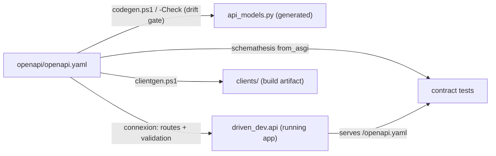
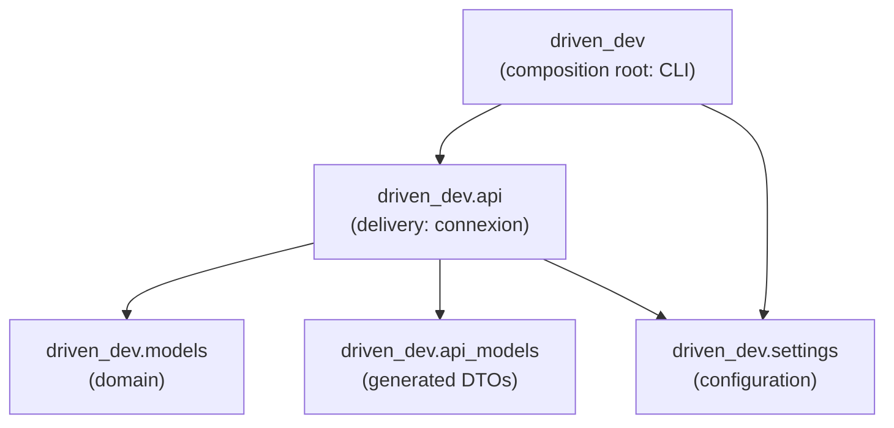
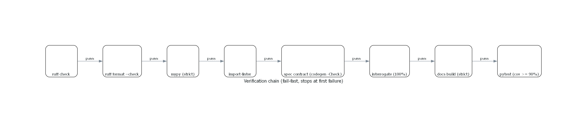

# Architecture

The single source of truth is `openapi/openapi.yaml`. Everything else is
derived, generated, or validated against it:

## Layers

| Layer | Module / artifact | Role |
|---|---|---|
| Spec | `openapi/openapi.yaml` | Contract: routes, schemas, handler wiring |
| Domain | `driven_dev.models` | Hand-written canonical models |
| API DTOs | `driven_dev.api_models` | **Generated** — never hand-edit |
| Service | `driven_dev.api` | connexion app; handlers resolved from the spec |
| Config | `driven_dev.settings` | Env-driven settings (`DRIVEN_DEV_` prefix) |

## Module layering

Imports are contracts, not conventions — enforced by import-linter
(`uv run lint-imports`, a check-chain step right after mypy):

Every arrow the architecture allows is shown; the contracts pin the rest:

- `models` ⟂ `settings` ⟂ `api_models` — mutually independent, no
  cross-imports;
- the leaves never import `driven_dev.api` (delivery);
- no module imports the composition root itself (the root *may* import
  anything — it is the wiring layer).

Rules live in pyproject `[tool.importlinter]`; rationale in
[ADR-0005](adr/0005-Enforce-module-architecture-with-import-linter.md).

## Gates

`check.ps1` / `check.sh` enforce the contract end to end, fail-fast
(rendered from code: `uv run python render_diagrams.py`):

1. `ruff check`
2. `ruff format --check`
3. `mypy` (strict)
4. **Architecture** — import-linter contracts (module boundaries)
5. **Spec contract** — spec validates; regenerated models must match committed ones
6. **Docstring coverage** — interrogate on `src/`
7. **Docs build** — `mkdocs build` (strict: broken links / unindexed pages fail)
8. `pytest` with coverage gate (≥ 90%)

## Related decisions

- [Spec-first API via connexion](adr/0002-Use-connexion-for-a-spec-first-API.md)
- [Local verification instead of hosted CI](adr/0004-Use-local-verification-instead-of-hosted-CI.md)
- [Enforce architecture with import-linter](adr/0005-Enforce-module-architecture-with-import-linter.md)
